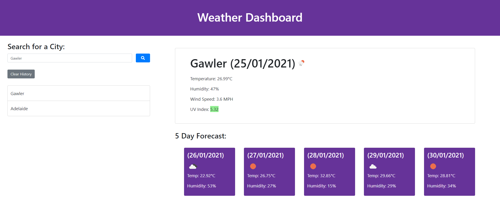

# weather-dashboard

## Description

The purpose of this project was to use the open weather api (https://openweathermap.org/) to create a web application that displays
certain weather information such as current temperature and a 5 day forecast for a certain city. The user inputs a city name, then
clicks the search button and the relevant information appears for that city. The user also has the option to view the cities they
have already searched for by clicking the button on the left hand side of the screen that corresponds to the city they wish to view
that they had previously searched for. There is also an option to clear this history.

## Screenshots

## Links

- Repo (Yes this one): https://github.com/TopGek99/weather-dashboard
- Webpage: https://topgek99.github.io/weather-dashboard